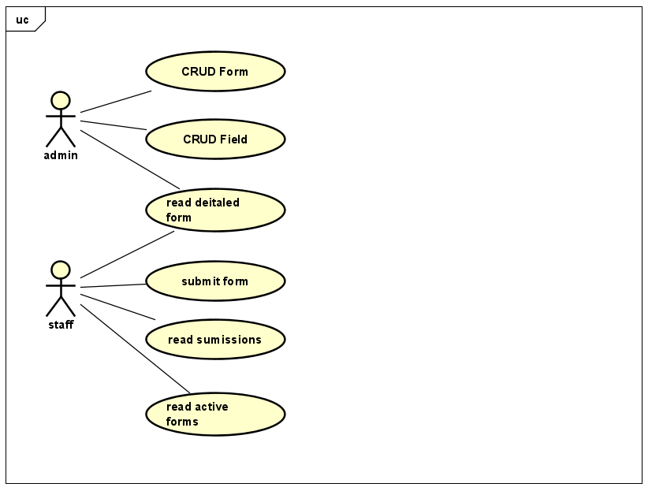
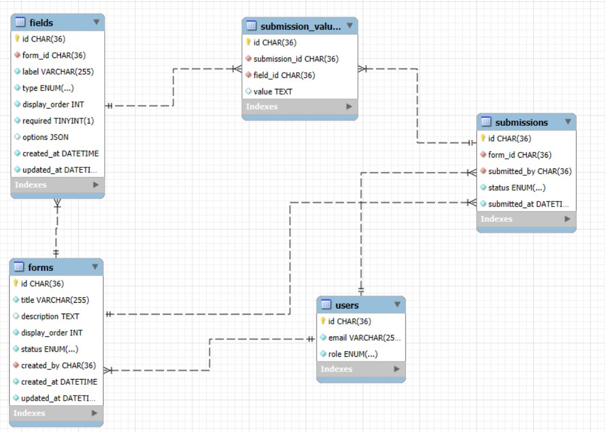

# Hướng Dẫn Chạy Dự Án NextGen 2026 (Dành Cho Giám Khảo Chấm Điểm)

Chào thầy/cô và các bạn, đây là tài liệu hướng dẫn chi tiết từng bước để cài đặt và chạy dự án **NextGen 2026** (Hệ thống Quản lý Form Động) trên máy cá nhân để phục vụ việc chấm điểm.

---

## 🚀 Phần 1: Hướng Dẫn Cài Đặt Và Chạy Dự Án (Setup Guide)

Dự án này sử dụng **Java 21**, **Spring Boot 4** và cơ sở dữ liệu **MySQL**. 

### Bước 1: Chuẩn bị môi trường (Prerequisites)
Vui lòng đảm bảo máy tính chấm điểm đã cài đặt:
- **MySQL Server** (đang chạy ở dưới background).
- **Java 21** (JDK 21).
- **Maven** (nếu muốn chạy bằng lệnh).
- Hoặc **Docker Desktop** (nếu muốn chạy ứng dụng qua Docker).

### Bước 2: Khởi tạo Cơ Sở Dữ Liệu MySQL
Dự án yêu cầu một database MySQL có sẵn ở máy tính chạy ứng dụng.
1. Mở phần mềm quản lý MySQL (ví dụ: MySQL Workbench, DBeaver, Navicat, phpMyAdmin...).
2. Copy toàn bộ câu lệnh SQL trong file **`database_script.sql`** (nằm ở thư mục gốc của project) và chạy.
3. Script này sẽ tự động:
   - Tạo database tên là `nextgen2026`.
   - Tạo các bảng cần thiết.
   - Insert sẵn một số tài khoản mẫu (`admin@company.com`, `staffa@company.com`).

### Bước 3: Cấu hình kết nối MySQL (Cực kỳ quan trọng)
Do cấu hình cấu hình MySQL ở mỗi máy khác nhau, thầy/cô vui lòng cấu hình lại thông số đăng nhập MySQL cho khớp với máy chấm điểm.

**Nếu dùng Port mặc định của MySQL là `3306`:**
*   **Chạy bằng IDE (IntelliJ, Eclipse) / Maven:** Mở file `src/main/resources/application.properties` và sửa dòng sau (đổi 3307 thành 3306, đồng thời sửa username và password):
    ```properties
    spring.datasource.url=jdbc:mysql://localhost:3306/nextgen2026?useSSL=false&serverTimezone=UTC&allowPublicKeyRetrieval=true
    spring.datasource.username=root        # <- Thay bằng username của thầy/cô
    spring.datasource.password=mat_khau    # <- Thay bằng password của thầy/cô
    ```
*   **Chạy bằng Docker:** Mở file `docker-compose.yml`, tìm dòng `SPRING_DATASOURCE_URL` đổi 3307 thành 3306, và sửa thông tin đăng nhập:
    ```yaml
      - SPRING_DATASOURCE_URL=jdbc:mysql://host.docker.internal:3306/nextgen2026?useSSL=false&serverTimezone=UTC&allowPublicKeyRetrieval=true
      - DB_USERNAME=root         # <- Thay bằng username của thầy/cô
      - DB_PASSWORD=mat_khau     # <- Thay bằng password của thầy/cô
    ```
*(Lưu ý: Nếu máy thầy/cô đang chạy MySQL ở port `3307` thì chỉ cần sửa mật khẩu, giữ nguyên số port 3307).*

### Bước 4: Chạy Ứng Dụng
Thầy/cô có thể chọn 1 trong 2 cách sau để chạy:

**Cách 1: Chạy trực tiếp qua IDE hoặc Maven (Khuyên dùng nếu đã cài sẵn JDK 21)**
Vì lý do bảo mật, mã nguồn sử dụng biến môi trường `${DB_USERNAME}` và `${DB_PASSWORD}`. Nếu anh/chị chạy thẳng lệnh `./mvnw spring-boot:run` sẽ bị lỗi *Access denied*.
Anh/chị hãy làm theo cách sau:

Mở file `src/main/resources/application.properties` và thay thế đoạn `${DB_USERNAME}` thành username thật (ví dụ `root`), và `${DB_PASSWORD}` thành password thật. Sau đó chạy lệnh:
```bash
./mvnw clean install -DskipTests
./mvnw spring-boot:run
```


**Cách 2: Chạy bằng Docker Compose (Ứng dụng chạy trong Docker, kết nối ra MySQL ở máy thật)**
Nếu đã cài Docker, chỉ cần chạy 1 lệnh duy nhất ở thư mục gốc của project:
```bash
docker compose up -d
```

### Bước 5: Kiểm tra API
Khi ứng dụng đã khởi động thành công ở port `8080`, thầy/cô vui lòng truy cập link sau để xem danh sách API và test trực tiếp (Swagger UI):
👉 **[http://localhost:8080/swagger-ui/index.html](http://localhost:8080/swagger-ui/index.html)**

---

## 🖼️ Phần 2: Thiết Kế Usecase
Dưới đây là sơ đồ Usecase thể hiện các chức năng chính của hệ thống.



*   **Admin**: Quản lý hệ thống người dùng, quản lý toàn bộ các biểu mẫu (Forms) trong toàn hệ thống.
*   **Staff**: Quản trị viên, trực tiếp thiết kế các biểu mẫu (thêm bớt các fields như Text, Number, Date, Select...), cấu hình trường bắt buộc (required) và theo dõi dữ liệu người dùng nộp về biểu mẫu do mình quản lý.

---

## 🗄️ Phần 3: Thiết Kế Cơ Sở Dữ Liệu (Database Design)
Hệ thống sử dụng cơ sở dữ liệu quan hệ MySQL. Dưới đây là sơ đồ thiết kế (ERD).



Hệ thống được thiết kế bao gồm 5 bảng chính được chuẩn hóa:
1.  **`users`**: Quản lý tài khoản và phân quyền (`role`: admin / staff).
2.  **`forms`**: Lưu trữ thông tin chung của biểu mẫu (Tiêu đề, trạng thái active/draft...).
3.  **`fields`**: Bảng cốt lõi định nghĩa cấu trúc của từng form. Một form có thể có nhiều field, mỗi field có một kiểu (`type`: text, number, date, select). Với loại `select`, các lựa chọn được lưu trữ linh hoạt trong cột `options` dưới định dạng JSON.
4.  **`submissions`**: Quản lý thông tin chung mỗi khi có người dùng nộp form (thời gian nộp, ai nộp).
5.  **`submission_values`**: Lưu trữ giá trị thực tế của từng field tương ứng với mỗi lượt submission. Cấu trúc này cho phép form có thể mở rộng số lượng câu hỏi vô hạn mà không cần tác động sửa đổi (ALTER) cấu trúc bảng.

---

## 🌐 Phần 4: Giải Thích Logic Dữ Liệu Đầu Vào (Input Payload) Các API

Project sử dụng trực tiếp trường `email` truyền trong body để định danh người dùng.

### 3.1. Form Management (Quản lý Biểu mẫu)
Các API này chịu trách nhiệm quản lý vòng đời của biểu mẫu. Về logic code (`AdminFormController`):

*   **`POST /api/forms` (Tạo Form)** & **`PUT /api/forms/:id` (Sửa Form)**:
    - **Logic**: Hệ thống nhận JSON payload, mapping vào `FormRequest` DTO. Dùng trường `email` để xác thực quyền (người tạo/sửa). Nếu hợp lệ, truyền dữ liệu xuống Service xử lý và lưu vào bảng `forms`.
    - **Input JSON mẫu**:
    ```json
    {
      "email": "admin@company.com", // Dùng để xác thực ai là người tạo/sửa
      "title": "Khảo sát chất lượng dự án",
      "description": "Form đánh giá chất lượng code",
      "displayOrder": 1, // Nếu không có displayOrder thì sẽ mặc định được để ở vị trí 1, hay nếu sửa vị trí của displayOrder thì form sẽ được cập nhật ở vị trí đó và các form khác sẽ được dịch chuyển tương ứng, ví dụ có 2 form là A và B, displayOrder của A là 1 và B là 2, nếu sửa displayOrder của A thành 2 thì B sẽ được dịch chuyển xuống vị trí 1
      "status": "DRAFT" // Các trạng thái: DRAFT, ACTIVE
    }
    ```

*   **`GET /api/forms` (Lấy danh sách Form)**:
    - **Logic**: API có sử dụng phân trang và sắp xếp thông qua các Query Params (`page`, `size`, `sortBy`, `sortDirection`). Đặc biệt, API này yêu cầu gửi kèm Body chứa DTO `AuthRequest` để lấy `email` định danh người gọi.
    - **Input JSON mẫu (Gửi trong Body của lệnh GET)**:
    ```json
    {
      "email": "admin@company.com"
    }
    ```

*   **`GET /api/forms/:id` (Lấy chi tiết Form)**:
    - **Logic**: API này nhận `:id` từ URL (Path Variable) và vẫn yêu cầu Body phải có `email` để xác thực quyền hạn. Nếu như email là staff thì sẽ xem được thông tin chi tiết những form đang ở trạng thái ACTIVE, còn nếu email là admin thì sẽ xem được thông tin chi tiết toàn bộ form (kể cả ACTIVE và DRAFT).
    - **Input JSON mẫu (Gửi trong Body)**:
    ```json
    {
      "email": "admin@company.com"
    }
    ```

*   **`DELETE /api/forms/:id` (Xóa Form)**:
    - **Logic**: Yêu cầu `:id` trên URL và `email` trong Body để định danh. Form sẽ bị xóa vĩnh viễn khỏi hệ thống (cần lưu ý quyền hạn thực hiện).
    - **Input JSON mẫu (Gửi trong Body)**:
    ```json
    {
      "email": "admin@company.com"
    }
    ```

### 3.2. Field Management (Quản lý Cấu trúc Field)
Dùng để thiết kế các câu hỏi (fields) bên trong biểu mẫu.

*   **`POST /api/forms/:id/fields` (Thêm Field)** & **`PUT /api/forms/:id/fields/:fid` (Sửa Field)**:
    - **Logic**: Sử dụng `FieldRequest` DTO (hoặc `UpdateFieldRequest`). Hệ thống lấy `email` từ body để định danh người thao tác. Cấu trúc này hỗ trợ nhiều kiểu dữ liệu. Đặc biệt với kiểu câu hỏi `select`, danh sách các đáp án phải được định dạng thành một mảng chuỗi JSON (JSON String) và truyền vào cột `options`. Chỉ người admin mới có quyền thao tác với field của form
    - **Input JSON mẫu**:
    ```json
    {
      "email": "admin@company.com",
      "label": "Mức độ hài lòng của bạn?",
      "type": "select", // Các kiểu hỗ trợ: text, number, date, color, select
      "displayOrder": 1, // Tương tự như Form, nếu sửa vị trí displayOrder thì các field khác sẽ tự động dịch chuyển lên/xuống tương ứng
      "required": true, // Bắt buộc nhập hay không
      "options": "[\"Rất hài lòng\", \"Bình thường\", \"Thất vọng\"]" // Bắt buộc là chuỗi JSON nếu type = select
    }
    ```

*   **`DELETE /api/forms/:id/fields/:fid` (Xóa Field)**:
    - **Logic**: API dùng để xóa một câu hỏi cụ thể ra khỏi Form. Nó nhận ID của form (`:id`) và ID của field (`:fid`) trên URL. Đồng thời yêu cầu Body chứa trường `email` (mapping vào `AuthRequest` DTO) để hệ thống kiểm tra phân quyền xem user này có được phép xóa field không. Chỉ người admin mới có quyền thao tác với field của form
    - **Input JSON mẫu (Gửi trong Body)**:
    ```json
    {
      "email": "admin@company.com"
    }
    ```

### 3.3. Submission (Nhân viên nộp bài)
Dành cho nhân viên điền form khảo sát.

*   **`GET /api/forms/active` (Lấy danh sách form đang mở)**:
    - **Logic**: Trả về danh sách các form đang có trạng thái ACTIVE để nhân viên có thể nộp. Có hỗ trợ phân trang và yêu cầu truyền `email` (vào Body của GET) để định danh.
    - **Input JSON mẫu (Gửi trong Body)**:
    ```json
    {
      "email": "staffb@company.com"
    }
    ```

*   **`POST /api/forms/:id/submit` (Nộp form)**:
    - **Logic**: Payload được mapping vào `SubmissionRequest`. Dùng `email` để xác định người nộp. Điểm đặc biệt: phần `values` được thiết kế dưới dạng `Map<String, String>` (Key là ID của câu hỏi, Value là câu trả lời). Khi nhận request, Backend sẽ duyệt qua Map này, kiểm tra logic `required` của từng field, sau đó lưu thành từng record độc lập vào bảng `submission_values` (Kiến trúc EAV).
    - **Input JSON mẫu**:
    ```json
    {
      "email": "staffb@company.com", // Người nộp bài
      "values": {
        "uuid-cua-field-cau-hoi-1": "Câu trả lời dạng chữ...",
        "uuid-cua-field-cau-hoi-2": "Rất hài lòng"
      }
    }
    ```

*   **`GET /api/submissions` (Xem lịch sử đã nộp)**:
    - **Logic**: Nhân viên xem lại danh sách các form mà mình đã submit. Hỗ trợ phân trang và nhận `email` trong Body để lọc ra các bài nộp của riêng người dùng đó.
    - **Input JSON mẫu (Gửi trong Body)**:
    ```json
    {
      "email": "staffb@company.com"
    }
    ```
